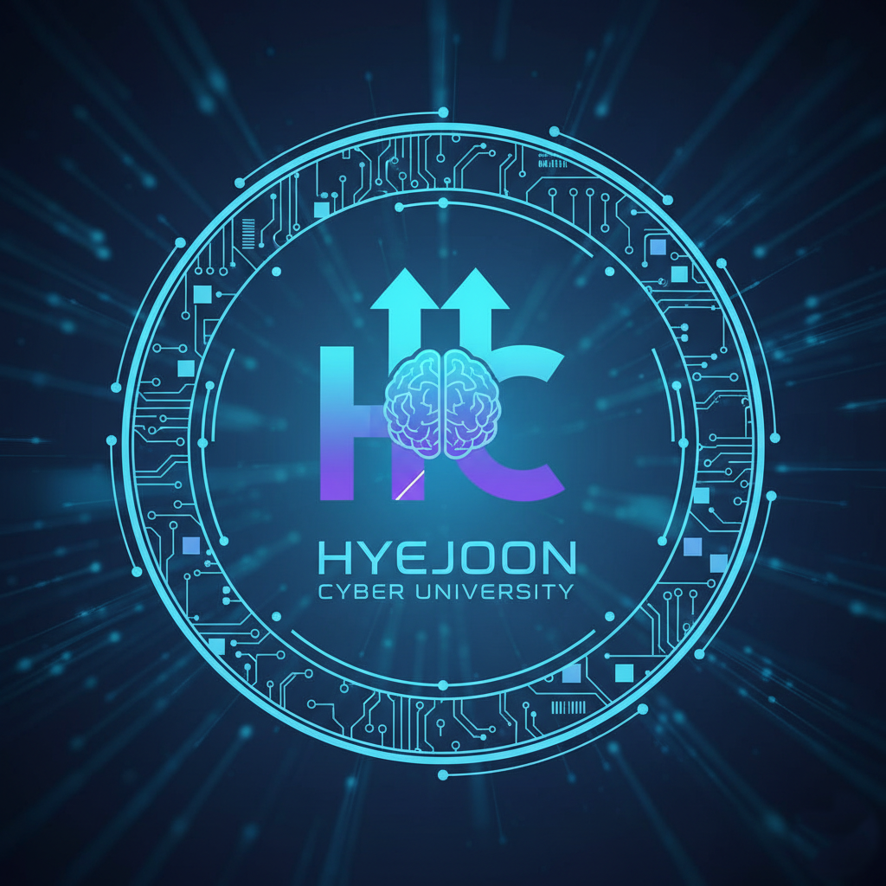

# 혜준 사이버 대학교 수강신청 프로젝트

<p align="center">
  
</p>

<p align="center">
  
  
  
  
  
  
  
</p>

---

## 📝 **프로젝트 소개**

**혜준 사이버 대학교 수강신청 시스템**은 대용량 트래픽 환경을 대비하여 동시성 제어, 캐싱, 검색 최적화 등 다양한 성능 개선 전략을 학습하고 비교 분석하기 위해 개발된 백엔드 프로젝트입니다.

<br>

## ✨ **주요 기능**

- 🔐 **로그인**: 학생 이메일과 비밀번호로 로그인하여 세션을 인증합니다.
- 📚 **강의 목록 조회**: 개설된 모든 강의 목록을 페이지네이션으로 조회합니다.
- ✅ **수강 신청**: 학생은 원하는 강의를 신청할 수 있습니다.
- ❌ **수강 취소**: 신청한 강의를 취소할 수 있습니다.
- 📋 **수강 내역 조회**: 학생 본인이 신청한 강의 목록을 조회합니다.

<br>

## 🛠️ **기술 스택**

| 구분 | 기술 | 설명 |
| --- | --- | --- |
| **언어** | `Java 17` | 핵심 프로그래밍 언어 |
| **프레임워크** | `Spring Boot 3.x` | 애플리케이션 개발 프레임워크 |
| **데이터베이스** | `MySQL 8.0` / `H2` | 기본 RDB 및 테스트용 인메모리 DB |
| **DB 마이그레이션** | `Flyway` | 데이터베이스 스키마 관리 및 버전 관리 |
| **ORM** | `Spring Data JPA` | 데이터 영속성 및 객체-관계 매핑 |
| **쿼리 빌더** | `QueryDSL` | 타입-세이프한 SQL 라이크 쿼리 작성 |
| **검색 엔진** | `Elasticsearch` | 고도화된 전문(Full-text) 검색 기능 |
| **인메모리 DB** | `Redis 7.4` | 캐싱, 메시징, 분산 락에 사용 |
| **분산 락**| `Redisson` | Redis 기반의 분산 Java 객체 및 서비스 |
| **빌드 도구** | `Gradle` | 의존성 관리 및 프로젝트 빌드 |
| **컨테이너화**| `Docker` | 일관성 있는 격리된 환경 구성 |

<br>

## 🚀 **실행 방법**

1.  **Docker 실행**: `docker-compose.yml` 파일이 있는 프로젝트 루트 디렉토리에서 아래 명령어를 실행하여 `MySQL`과 `Redis` 컨테이너를 실행합니다.

    ```bash
    docker compose up -d
    ```

2.  **애플리케이션 실행**: IDE에서 `CuvcourseApplication.java` 파일을 직접 실행하거나, 아래 Gradle 명령어를 통해 애플리케이션을 실행합니다.

    ```bash
    ./gradlew bootRun
    ```

<br>

## 📖 **API 명세**

| 기능 | HTTP Method | URI | Request Header | Request Body | 성공 응답 |
| --- | --- | --- | --- | --- | --- |
| **로그인** | `POST` | `/api/students/login` | - | `email`, `password` | `studentId` |
| **강의 목록 조회** | `GET` | `/api/lectures` | - | `page`, `size` (Query) | 강의 목록 (페이지네이션) |
| **수강 신청** | `POST` | `/api/courses` | `X-STUDENT-ID` | `lectureId` | `courseId`, `lectureId` |
| **수강 취소** | `DELETE` | `/api/courses` | `X-STUDENT-ID` | `lectureId` | - |
| **수강 내역 조회** | `GET` | `/api/courses` | `X-STUDENT-ID` | - | 신청한 강의 목록 |

<br>

## 🏛️ **핵심 아키텍처**

이 프로젝트에서는 성능 개선을 위해 여러 팀원이 각기 다른 기술을 적용하고 그 효과를 비교 분석했습니다.

### 1. 동시성 제어 (Distributed Lock)

수강 신청 기능에서 발생할 수 있는 Race Condition을 해결하기 위해 Redis 기반의 분산 락을 적용했습니다.

- **Redisson `RLock`**: RedissonClient가 제공하는 `RLock`을 사용하여 분산 환경에서 Lock을 구현했습니다.
- **Lettuce Spin Lock**: Redis의 `SETNX` 명령어를 활용하여 Lock을 구현하고, Lock 획득 실패 시 Spin Lock 방식으로 재시도합니다.
- **Redis Pub/Sub**: Spin Lock의 부하를 줄이기 위해, Lock 해제 시 대기 중인 스레드들에게 메시지를 발행(Publish)하여 Lock 획득을 시도하도록 하는 Pub/Sub 모델을 적용했습니다.

### 2. 캐싱 전략 (Caching Strategies)

조회 성능 향상을 위해 다음과 같은 두 가지 캐싱 전략을 각각 적용하고 비교했습니다.

- **접근 방식 A: Spring Cache와 `@Cacheable`**
    - Spring Boot가 제공하는 `@Cacheable` 어노테이션을 사용하여 강의 목록 조회 등 반복적인 요청에 대한 응답을 Redis에 캐싱했습니다.
    - 데이터 변경 시 `@CacheEvict`를 통해 관련 캐시를 무효화하여 데이터 일관성을 유지합니다.

- **접근 방식 B: Redis Semaphore를 이용한 수동 캐싱**
    - Redis의 세마포어를 활용하여 캐시 초기화 작업에 대한 동시 접근을 제어하는 수동 캐싱 전략을 구현했습니다.
    - 이를 통해 Cache Stampede(캐시가 동시에 만료되어 DB에 부하가 몰리는 현상)를 방지하고, 안정적인 캐시 갱신을 보장합니다.

### 3. 검색 최적화 (Search Optimization)

강의 검색 기능의 성능과 정확도를 높이기 위해 두 가지 다른 검색 솔루션을 적용했습니다.

- **접근 방식 A: MySQL Full-Text Search**
    - `LIKE '%keyword%'` 검색의 한계를 극복하기 위해 MySQL의 Full-Text Search 기능을 도입했습니다.
    - 특히, 한글 검색을 위해 `ngram` 파서를 사용하여 두 글자 이상의 단어에 대한 효과적인 검색을 구현했습니다.

- **접근 방식 B: Elasticsearch 단일 솔루션**
    - 더 빠르고 고도화된 검색 기능을 위해 검색 엔진 Elasticsearch를 도입했습니다.